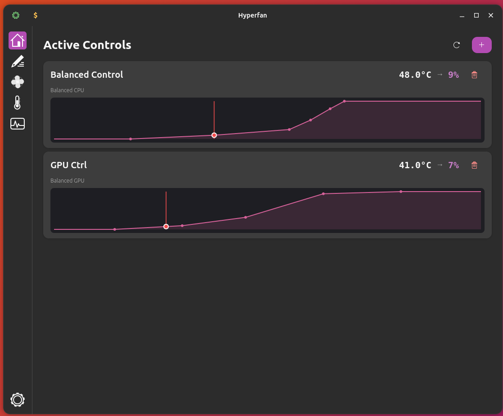
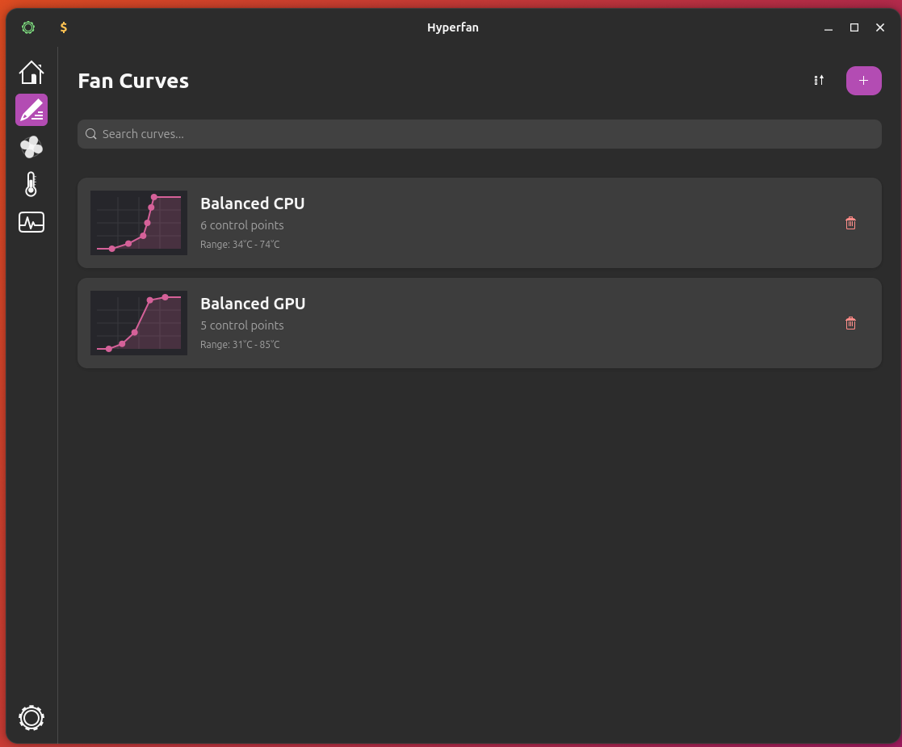
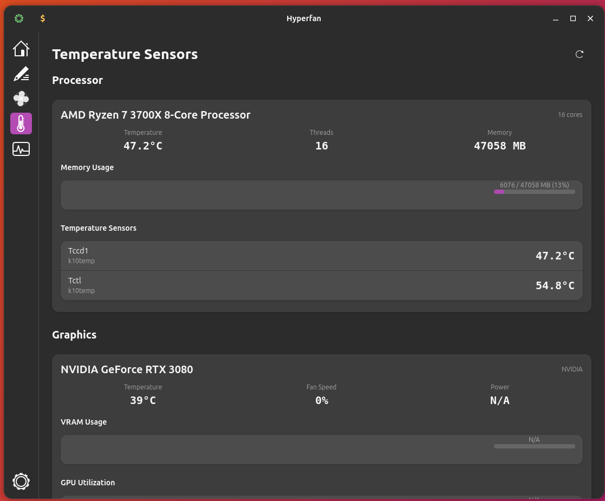
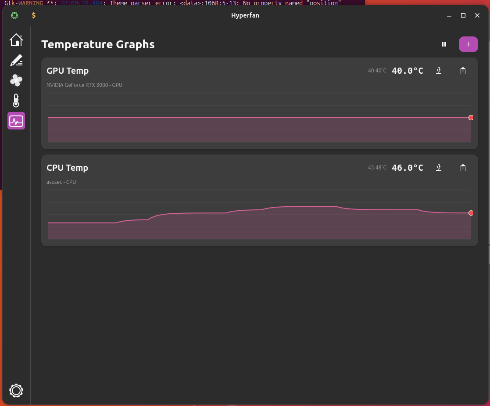
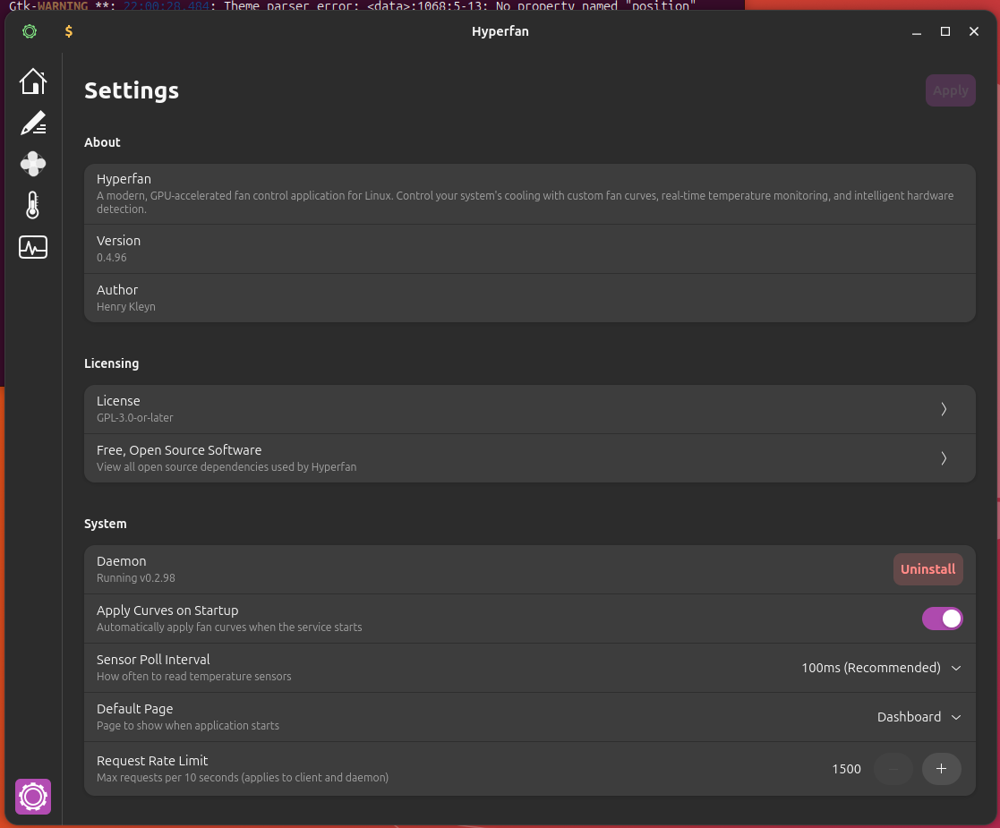

# Donation request!
I need an Intel ARC GPU to validate hyperfan against real hardware. can you help? See my Kofi link or get in touch. THANK YOU!

# Hyperfan
Fan control platform for Linux enthusiasts who demand precise thermal management, written in Rust!

Hyperfan provides comprehensive control over system cooling with a modern GTK4 interface, robust hardware detection, and safety-first architecture. Whether you're building a silent workstation, optimizing a gaming rig, or managing server thermals, Hyperfan delivers the precision you need. QT4 support is planned, but work on this has not yet been started. 

Hyperfan is in early ALPHA! It requires substantial testing and validation.

EC control is exceptionaly early in its development, and should not be used for anything other than testing. BE VERY CAUTIOUS WITH DIRECT EC CONTROL!

---

## Key Features

### Hardware Detection and Fingerprinting
- Automatic discovery of all temperature sensors, fans, and PWM controllers
- Advanced hardware fingerprinting survives reboots and hwmon reindexing
- Confidence-based matching algorithm for stable fan pairing
- Support for any hwmon-compatible device

### Visual Fan Curve Editor
- Interactive drag-and-drop curve editor
- Real-time preview with live temperature indicator
- Piecewise linear interpolation
- Configurable smoothing to prevent oscillation
- Multiple curves per profile

### Comprehensive GPU Support
- NVIDIA: Full control via nvidia-smi and nvidia-settings
- AMD: Complete amdgpu sysfs integration (VRAM, power, multi-fan)
- Intel: i915/xe hwmon monitoring and discrete GPU control
- Multi-GPU systems fully supported
- Per-GPU, per-fan control

### Privilege Separation Architecture
- Unprivileged GUI (hf-gtk) for user interface
- Privileged daemon (hf-daemon) for hardware control
- Secure Unix socket IPC
- systemd service integration
- Safety-first design with automatic fallbacks

### Real-Time Monitoring
- Live temperature and fan speed graphs
- GPU metrics: VRAM usage, power draw, utilization
- 100ms control loop for responsive adjustments
- 1-second GUI updates for efficiency
- Smooth exponential moving average filtering

### Profile System
- JSON-based configuration
- Multiple profiles for different scenarios
- Hardware fingerprint validation
- Automatic profile migration
- Curve library for reusable configurations

---

## Architecture

Hyperfan is built as a modular Rust workspace with clean separation of concerns:

| Crate | Description |
|-------|-------------|
| **hf-gtk** | GTK4/Libadwaita GUI application (unprivileged) |
| **hf-daemon** | System daemon for hardware control (privileged) |
| **hf-core** | Core library: hwmon detection, PWM control, fingerprinting |
| **hf-gpu** | GPU-specific library: NVIDIA, AMD, Intel implementations |
| **hf-protocol** | IPC protocol definitions for daemon communication |
| **hf-error** | Unified error types across all crates |

### Design Principles

- **Safety First**: Always fall back to 100% fan speed on errors
- **Privilege Separation**: Minimize attack surface with unprivileged GUI
- **Hardware Agnostic**: Support diverse hardware configurations
- **Modular Design**: Clean crate boundaries for maintainability
- **Type Safety**: Leverage Rust's type system for correctness

---

## Screenshots








---

## Quick Start

### Requirements

- Linux with sysfs hwmon support
- GTK4 4.12+ and libadwaita 1.5+
- Rust toolchain 1.70+ (for building from source)
- Optional: nvidia-smi and nvidia-settings (for NVIDIA GPU control)
- Optional: systemd (recommended for daemon service)

### Install Dependencies

**Debian/Ubuntu:**
```bash
sudo apt install libgtk-4-dev libadwaita-1-dev
```

**Fedora:**
```bash
sudo dnf install gtk4-devel libadwaita-devel
```

**Arch:**
```bash
sudo pacman -S gtk4 libadwaita
```

### Build and Run

```bash
# Clone the repository
git clone https://github.com/HK01569/hyperfan.git
cd hyperfan

# Build optimized release
cargo build --workspace --release

# Run the GUI
./target/release/hyperfan
```

### Install the Daemon
Moved in-program. To install the daemon, you will need to open hyperfan, navigate to settings, then isntall the daemon from there. You will need sudo to do this.

---

## Advanced Features

### Hardware Fingerprinting

Hyperfan uses stable hardware identifiers to maintain fan pairings across reboots:

- PCI bus ID (e.g., "0000:00:18.3")
- PCI vendor and device IDs
- Driver name and chip model
- PWM channel number

Confidence-based matching algorithm:
- **>0.90**: Safe to use automatically
- **>0.70**: Warn user but allow
- **>0.40**: Require manual confirmation
- **<0.40**: Refuse to use (unsafe)

### GPU Fan Control

**NVIDIA GPUs:**
- Requires nvidia-smi and nvidia-settings
- X11 session with Coolbits enabled
- Supports multiple GPUs and fans per GPU
- Manual and automatic control modes

**AMD GPUs:**
- Direct sysfs control via amdgpu driver
- VRAM usage monitoring
- Power consumption tracking
- Multi-fan GPU support

**Intel GPUs:**
- Temperature monitoring via i915/xe hwmon
- Fan control on discrete GPUs (Arc series)
- Integrated GPU monitoring

### Safety Mechanisms

- Input validation on all user inputs
- Path traversal protection
- File size limits on configurations
- Automatic fallback to 100% on errors
- Profile integrity validation
- Hardware state monitoring

---

## Documentation

was in /docs/, but I plan a migration to in app documentation for ease of use. WORK IN PROGRESS!


---

## Contributing

Contributions are welcome! Whether it's bug reports, feature requests, or pull requests, your input helps make Hyperfan better for everyone.

---

## Support Development

If Hyperfan helps keep your system cool, consider supporting development:

[](https://ko-fi.com/henryk44801)

---

## License

GNU General Public License v3.0 or later. See [LICENSE.md](LICENSE.md).

---

## Author

**Henry Kleyn** - [GitHub](https://github.com/HK01569)
